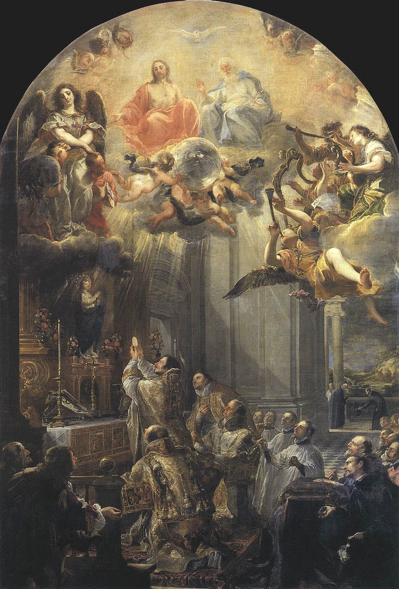
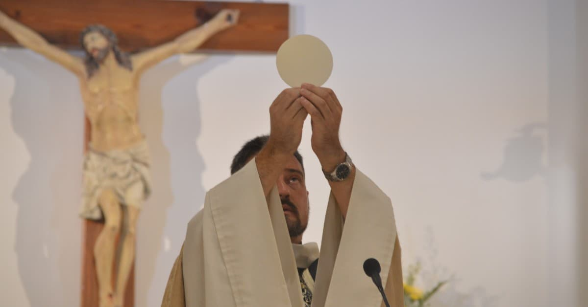

+++
title = "Elevation of the Eucharist"
date = 2026-06-06
[extra]
category = "leviticus"
category_label = "Leviticus"
+++
Leviticus 8:29

> "And he took of the ram of consecration, the breast for his portion, elevating it before the Lord, as the Lord had commanded him."

    

        
    

    

        
    

### References

- [1] [Leviticus 8:29 (DRA)](https://www.biblegateway.com/passage/?search=Leviticus%208%3A29&version=DRA)

+JMJ+
